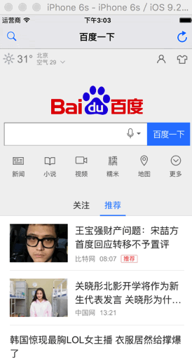

#### WebView加载进度条

使用示例:

```
添加进度条

- (void)viewWillAppear:(BOOL)animated
{
    [super viewWillAppear:animated];
    [self.navigationController.navigationBar addSubview:_progressView];
}
```

```
移除进度条

- (void)viewWillDisappear:(BOOL)animated
{
    [super viewWillDisappear:animated];
    // Remove progress view
    // because UINavigationBar is shared with other ViewControllers
    [_progressView removeFromSuperview];
}
```
```
初始化进度条

    _progressProxy = [[NJKWebViewProgress alloc] init];
    _progressProxy.webViewProxyDelegate = self;
    _progressProxy.progressDelegate = self;
    UIWebView *webView = [[UIWebView alloc] initWithFrame:self.view.bounds];
    [self.view addSubview:webView];
    webView.delegate = _progressProxy;
    _webView = webView;
    
    
    CGFloat progressBarHeight = 2.f;
    CGRect navigationBarBounds = self.navigationController.navigationBar.bounds;
    CGRect barFrame = CGRectMake(0, navigationBarBounds.size.height - progressBarHeight, navigationBarBounds.size.width, progressBarHeight);
   _progressView = [[NJKWebViewProgressView alloc] initWithFrame:barFrame];
    _progressView.autoresizingMask = UIViewAutoresizingFlexibleWidth | UIViewAutoresizingFlexibleTopMargin;
```
```
代理方法

#pragma mark - <NJKWebViewProgressDelegate>

-(void)webViewProgress:(NJKWebViewProgress *)webViewProgress updateProgress:(float)progress
{
    [_progressView setProgress:progress animated:YES];
    self.title = [_webView stringByEvaluatingJavaScriptFromString:@"document.title"];
}
```


效果演示:


